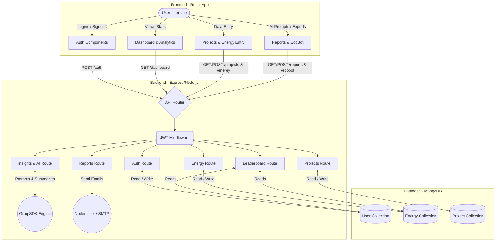

# Detailed Design Architecture (DDA) Diagram

Below is the Mermaid code for the DDA (Detailed Design / Data Delivery Architecture) diagram of your CSR Banpasumai application. This captures the complete flow from your React frontend to the Express backend components and MongoDB database.

